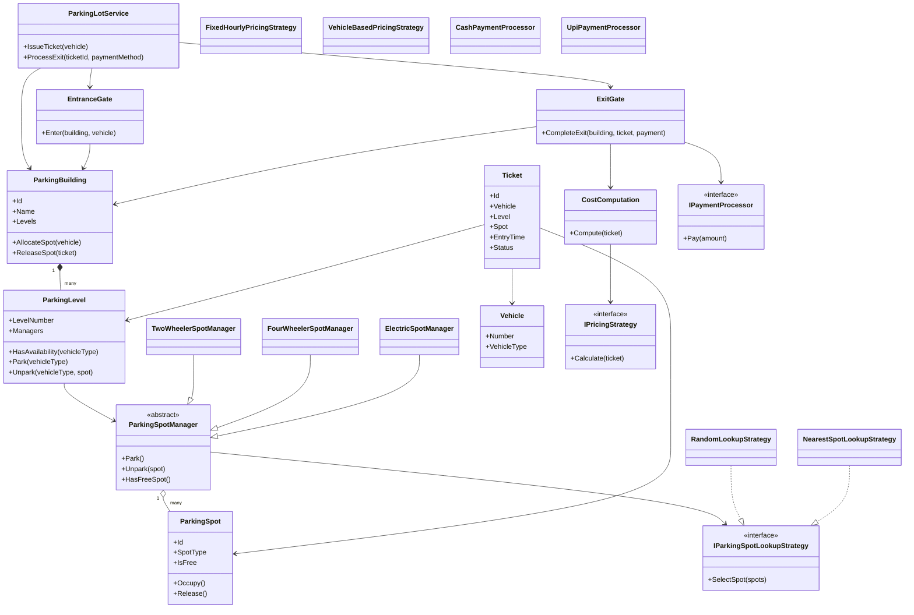
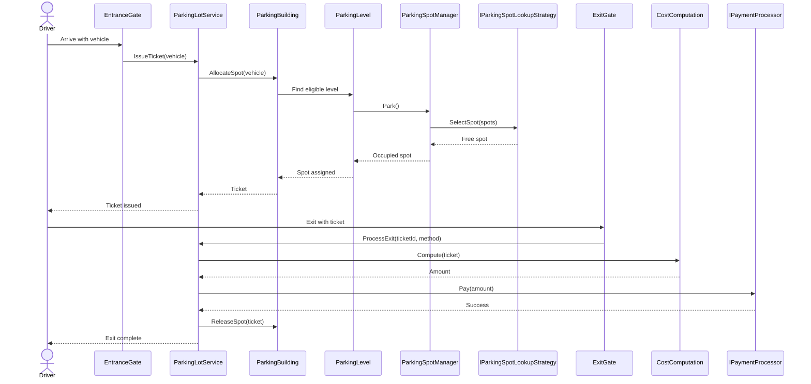

# Design Parking Lot in .NET

This project is a design-first implementation of the Parking Lot low-level design problem in .NET.

The goal is to build the system step by step, starting with a clean domain model and UML before writing application code. The design is inspired by the Java reference shared earlier, which uses concepts such as `ParkingBuilding`, `ParkingLevel`, `ParkingSpot`, `Ticket`, `ParkingSpotManager`, `ParkingSpotLookupStrategy`, and `PricingStrategy`.

## How To Use This Project As A Beginner

If you are new to low-level design, do not try to memorize the UML or all the classes at once.

Follow this order instead:

1. First understand the real-world story.
2. Then identify the nouns in that story.
3. Then identify the actions in that story.
4. Then decide which class should own which action.
5. Only after that should you think about design patterns.

For this problem, the real-world story is simple:

- A vehicle arrives.
- The system finds a valid free spot.
- The system creates a ticket.
- The vehicle stays parked.
- At exit, the system calculates the amount.
- Payment happens.
- The spot becomes free again.

If you can explain that flow clearly, you already understand the core problem.

## Mental Model Before Code

Think of this design in four layers:

### 1. Static structure

These are the things that exist in the system:

- Building
- Level
- Spot
- Vehicle
- Ticket

These are usually modeled as entities.

### 2. Behavior

These are the actions the system performs:

- Allocate a spot
- Release a spot
- Calculate price
- Take payment

These usually belong in managers, services, or strategies.

### 3. Rules

These are business decisions:

- Which spot can a vehicle use?
- Which free spot should be chosen first?
- How much should the vehicle pay?

These rules often change, which is why we avoid hardcoding them everywhere.

### 4. Flow orchestration

This is the end-to-end journey:

- Entry flow
- Exit flow

This is usually handled by a facade or application service.

## Design Patterns In Plain English

This project is a good place to learn patterns because each one solves a very real problem.

### Strategy Pattern

Use this when the system can do the same job in different ways.

In this problem:

- A spot can be chosen by random selection.
- A spot can be chosen by nearest-to-entry.
- A price can be calculated by fixed hourly rules.
- A price can be calculated by slabs or vehicle type.

Instead of writing one giant `if-else` block, we create interchangeable strategies.

Beginner rule:

- If behavior changes often, think `Strategy`.

### Factory Pattern

Use this when object creation itself has logic.

In this problem:

- Based on vehicle type, you may want a different spot manager.
- Based on payment method, you may want a different payment processor.

Instead of scattering `new CashPaymentProcessor()` and `new UpiPaymentProcessor()` everywhere, a factory can create the correct object.

Beginner rule:

- If choosing which object to create starts becoming a decision, think `Factory`.

### Facade Pattern

Use this when the internal system has many moving parts, but callers should see a simple API.

In this problem:

- Entry involves building, level, manager, strategy, spot, and ticket.
- Exit involves ticket lookup, price calculation, payment, and release.

The outside world should still see something simple like:

- `IssueTicket(vehicle)`
- `ProcessExit(ticketId, paymentMethod)`

Beginner rule:

- If the inside is complicated but the outside should feel simple, think `Facade`.

### Template Method Or Base Class

Sometimes multiple managers behave almost the same, with only small differences.

In this problem:

- `TwoWheelerSpotManager`
- `FourWheelerSpotManager`
- `ElectricSpotManager`

If most logic is shared, a base `ParkingSpotManager` can hold the common behavior while concrete managers customize only what differs.

Beginner rule:

- If classes share a lot of behavior, pull the common parts upward carefully.

### State Pattern

We may not need this immediately, but it is worth noticing.

Today a spot may only be:

- Free
- Occupied

Later it might be:

- Free
- Occupied
- Reserved
- OutOfService

At first, a boolean is enough. If transitions become complex, the `State` pattern may become useful.

Beginner rule:

- Do not force `State` too early. Use it only when state transitions become a real source of complexity.

## How To Think During An LLD Interview

When given a problem like this, train yourself to answer in this order:

1. What are the main entities?
2. What actions does the system need to support?
3. Which rules are likely to change?
4. Which parts should be extensible?
5. Which design patterns naturally fit those change points?

For Parking Lot, a strong first answer is:

- Entities: `Vehicle`, `ParkingSpot`, `ParkingLevel`, `ParkingBuilding`, `Ticket`
- Actions: allocate, unpark, calculate cost, take payment
- Change points: spot allocation rule, pricing rule, payment method
- Patterns: strategy for rules, facade for flow, factory if object creation starts branching

That answer is already much stronger than jumping straight into code.

## Objective

Design a parking system where:

- A parking building contains multiple levels.
- Each level contains multiple parking spots.
- Spots may be reserved for specific categories such as two-wheelers, four-wheelers, and EVs.
- Vehicles enter through an entrance gate and receive a ticket.
- Vehicles exit through an exit gate, the fee is calculated, payment is collected, and the spot is released.
- Spot allocation and pricing should be pluggable through strategies.

## Scope for Version 1

We will start with an in-memory interview-friendly design and keep it extensible.

### Functional requirements

- Support multiple parking levels.
- Support multiple spot types.
- Support vehicle-to-spot compatibility rules.
- Allocate the best available spot when a vehicle arrives.
- Generate a parking ticket at entry.
- Calculate cost at exit.
- Process payment.
- Release the occupied spot after a successful exit.

### Non-functional requirements

- Keep the design modular and testable.
- Avoid tight coupling between parking, pricing, and payment.
- Support easy addition of new pricing or allocation strategies.
- Keep concurrency in mind so the same spot is not assigned twice.

## Core Domain Model

### Main entities

- `ParkingBuilding`: root aggregate containing all levels.
- `ParkingLevel`: contains parking spots and managers for each supported category.
- `ParkingSpot`: represents a single spot and its occupancy state.
- `Vehicle`: vehicle number and vehicle type.
- `Ticket`: issued at entry, holds vehicle, allocated spot, level, and entry time.
- `EntranceGate`: coordinates entry flow.
- `ExitGate`: coordinates exit flow.

### Supporting abstractions

- `IParkingSpotLookupStrategy`: decides which free spot to choose.
- `IPricingStrategy`: decides how parking cost is computed.
- `IPaymentProcessor`: abstracts payment collection.
- `ParkingSpotManager`: manages a set of spots with locking and allocation rules.

## Recommended .NET Model

The Java version keeps the design intentionally simple. For the .NET version, we should keep the same spirit while tightening a few areas:

- Use interfaces for strategy-driven behavior.
- Keep business logic out of controllers or UI entry points.
- Prefer immutable ticket data once issued.
- Model spot type separately from vehicle type.
- Keep orchestration in a service or facade instead of spreading it across the app.
- Make the payment and pricing components swappable.

## Key Enums

Suggested enums for the .NET version:

- `VehicleType`: `TwoWheeler`, `FourWheeler`, `ElectricCar`
- `ParkingSpotType`: `TwoWheeler`, `Compact`, `Large`, `Electric`
- `TicketStatus`: `Active`, `Paid`, `Closed`
- `PaymentStatus`: `Pending`, `Succeeded`, `Failed`
- `PaymentMethod`: `Cash`, `Upi`, `Card`

## High-Level Architecture



## Entry and Exit Flow



## Design Decisions

Before looking at the detailed decisions below, remember this simple mapping:

- Entities model data.
- Managers control operations on a group of entities.
- Strategies hold replaceable business rules.
- Services or facades coordinate end-to-end use cases.

If you keep that one mapping in your head, most LLD diagrams become much easier to understand.

### 1. Separate vehicle type from spot type

This gives us room to express compatibility rules such as:

- `TwoWheeler` can use `TwoWheeler` spots.
- `FourWheeler` can use `Compact` or `Large` spots.
- `ElectricCar` prefers `Electric` but may optionally fall back to `Compact` if the business rule allows it.

This is more flexible than treating each vehicle category as a direct one-to-one spot type mapping.

### 2. Use strategy pattern where behavior may vary

We should use strategies for:

- Spot selection
- Pricing
- Payment processing

This keeps the core model stable while business rules evolve.

### 3. Keep managers responsible for allocation mechanics

`ParkingSpotManager` is a good place to hold:

- The list of spots it owns
- Locking and occupancy updates
- Collaboration with the lookup strategy

This aligns well with the Java reference and maps cleanly into .NET.

### 4. Keep orchestration in a facade/service

The high-level API should be simple:

- `IssueTicket(vehicle)`
- `ProcessExit(ticketId, paymentMethod)`

This is cleaner for testing and for future API or console layers.

## Proposed Project Structure

```text
DesignParkingLot/
|-- README.md
|-- src/
|   |-- DesignParkingLot.Domain/
|   |   |-- Entities/
|   |   |-- Enums/
|   |   |-- ValueObjects/
|   |   |-- Strategies/
|   |   |-- Managers/
|   |   |-- Services/
|   |   |-- Payments/
|   |   `-- Pricing/
|   |-- DesignParkingLot.Application/
|   `-- DesignParkingLot.Console/
`-- tests/
    `-- DesignParkingLot.Tests/
```

## Implementation Roadmap

We should build this in the following order.

### Phase 1: Foundation

- Create the solution and class library projects.
- Add enums.
- Add `Vehicle`, `ParkingSpot`, and `Ticket`.
- Add basic unit tests for occupancy and ticket creation.

### Phase 2: Parking structure

- Add `ParkingLevel`.
- Add `ParkingBuilding`.
- Add `ParkingSpotManager` and concrete managers.
- Add vehicle-to-spot compatibility rules.

### Phase 3: Strategy layer

- Add `IParkingSpotLookupStrategy`.
- Implement `RandomLookupStrategy` first.
- Add `IPricingStrategy` and a simple fixed-hour strategy.
- Add `CostComputation`.

### Phase 4: Entry and exit flows

- Add `EntranceGate` and `ExitGate`.
- Add `ParkingLotService` as the main facade.
- Add ticket tracking and exit processing.

### Phase 5: Payment and extensibility

- Add `IPaymentProcessor`.
- Add `CashPaymentProcessor` and `UpiPaymentProcessor`.
- Add better error handling and ticket status transitions.

### Phase 6: Hardening

- Add concurrency protection around allocation.
- Add more tests around double booking and release flows.
- Add alternative strategies such as nearest spot selection and variable pricing.

## Best Practices We Will Follow

- Small, focused classes with one clear responsibility.
- Favor composition over inheritance unless inheritance gives real value.
- Keep interfaces where behavior is expected to vary.
- Keep domain logic independent from UI or infrastructure.
- Write tests for every major behavior as we build.
- Avoid premature persistence or database complexity in the first iteration.

## Open Questions Before Coding

These are the only design choices we should confirm before implementation:

1. Should EV vehicles be allowed to fall back to non-EV car spots if EV spots are full?
2. Do we want one manager per vehicle category, or one manager per spot category plus a compatibility policy?
3. Should the first version support multiple gates explicitly, or just keep the gate abstraction ready?
4. Should pricing be hourly only in v1, or include slabs from the start?
5. Do we want the first runnable version as a console app, tests only, or both?

## Suggested First Coding Step

Start with the domain foundation only:

- `VehicleType`
- `ParkingSpotType`
- `Vehicle`
- `ParkingSpot`
- `Ticket`

That gives us stable primitives before we add managers, strategies, and gate flows.

## How We Will Learn This Step By Step

We will not jump to the full solution. We will build understanding in layers.

### Step 1: Learn to find entities

Question to ask yourself:

- What are the objects that exist even if no code exists yet?

For this problem, the answer is things like `Vehicle`, `ParkingSpot`, `ParkingLevel`, and `Ticket`.

### Step 2: Learn to find responsibilities

Question to ask yourself:

- What should each object know?
- What should each object do?

Example:

- A `Vehicle` should know its number and type.
- A `ParkingSpot` should know whether it is free.
- A `Ticket` should know which vehicle entered, where it parked, and when.

### Step 3: Learn to spot change points

Question to ask yourself:

- Which business rules are likely to change in the future?

For this problem, the big change points are:

- Allocation rule
- Pricing rule
- Payment method

Those are good candidates for interfaces and patterns.

### Step 4: Learn to introduce patterns only when needed

This is critical.

Do not start with patterns.
Start with the problem.
Then use a pattern only when it removes pain.

Example:

- If pricing is fixed forever, no strategy is needed.
- If pricing may vary, strategy becomes useful.

This is how strong engineers think.

### Step 5: Learn to keep the public API simple

Even if the internals are detailed, the outside interaction should stay simple.

For this project, we want the main use cases to feel like:

- Park a vehicle
- Exit a vehicle
- Check availability

That mindset leads naturally to a service or facade.

## What You Should Master From This Problem

If you learn this problem properly, you should come away with these skills:

- Turning a real-world story into classes and responsibilities
- Separating data objects from behavioral components
- Recognizing change points and applying strategy cleanly
- Avoiding giant god classes
- Building a design incrementally instead of overengineering too early

## Recommended Study Habit

For each class we build later, ask these five questions:

1. Why does this class exist?
2. What information should it own?
3. What behavior should it own?
4. What should it not know about?
5. If requirements change, is this class likely to change too much?

If you can answer those five questions confidently, you are actually learning design, not just copying code.